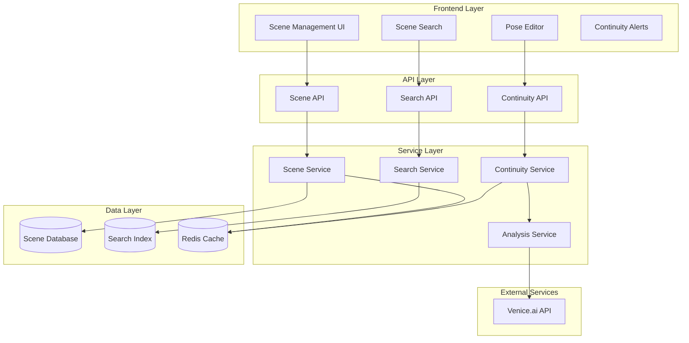
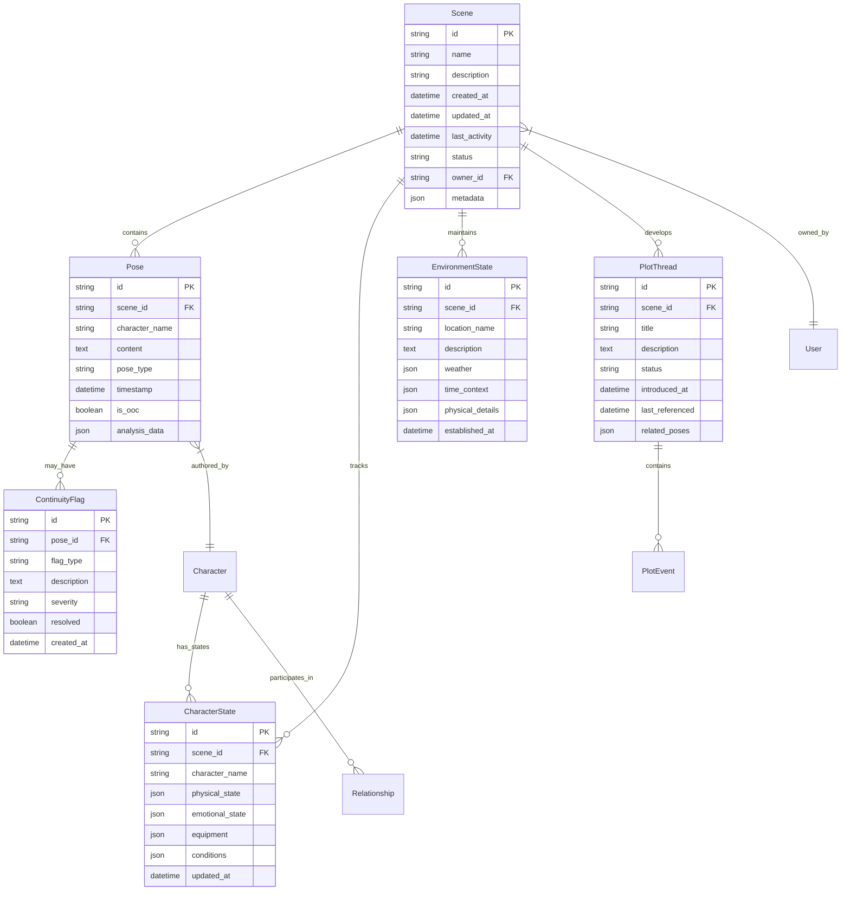

# Scene Memory & Continuity Tracking - Design Document

## Overview

The Scene Memory & Continuity Tracking system is designed as a comprehensive data management and analysis layer that sits between the existing MUSH Pose Editor and the Venice.ai integration. It provides persistent storage, intelligent analysis, and real-time continuity checking for MUSH roleplay sessions.

The system leverages the existing Venice.ai Dolphin model for content analysis while introducing new data models, services, and APIs to handle scene persistence, character state tracking, and continuity validation.

## Architecture

### High-Level Architecture



### Database Architecture

The system uses SQLite for development and PostgreSQL for production, with the following schema design:



## Components and Interfaces

### 1. Scene Management Service

**Purpose:** Core service for managing scene lifecycle, pose storage, and basic scene operations.

**Key Methods:**
```python
class SceneService:
    def create_scene(self, name: str, description: str, owner_id: str) -> Scene
    def add_pose(self, scene_id: str, pose_data: PoseData) -> Pose
    def get_scene_history(self, scene_id: str, limit: int = 100) -> List[Pose]
    def update_scene_activity(self, scene_id: str) -> None
    def archive_inactive_scenes(self, days_threshold: int = 30) -> List[str]
    def get_user_scenes(self, user_id: str) -> List[Scene]
```

**Integration Points:**
- Existing pose enhancement APIs
- Venice.ai for content analysis
- Search indexing service

### 2. Continuity Analysis Service

**Purpose:** AI-powered analysis of poses for continuity checking, character consistency, and plot tracking.

**Key Methods:**
```python
class ContinuityService:
    def analyze_pose_continuity(self, pose: Pose, scene_context: SceneContext) -> ContinuityAnalysis
    def check_character_consistency(self, pose: Pose, character_history: List[Pose]) -> ConsistencyCheck
    def extract_plot_elements(self, pose: Pose) -> List[PlotElement]
    def detect_environment_changes(self, pose: Pose, current_environment: EnvironmentState) -> EnvironmentUpdate
    def flag_continuity_issues(self, analysis: ContinuityAnalysis) -> List[ContinuityFlag]
```

**AI Integration:**
- Uses Venice.ai Dolphin model for content analysis
- Specialized prompts for continuity checking
- Character voice consistency validation
- Plot element extraction and tracking

### 3. Character State Tracking Service

**Purpose:** Maintains and updates character states throughout scenes, tracking physical, emotional, and situational changes.

**Key Methods:**
```python
class CharacterStateService:
    def initialize_character_state(self, scene_id: str, character_name: str, initial_state: dict) -> CharacterState
    def update_character_state(self, scene_id: str, character_name: str, updates: dict) -> CharacterState
    def get_character_current_state(self, scene_id: str, character_name: str) -> CharacterState
    def track_character_relationships(self, scene_id: str, interactions: List[Interaction]) -> None
    def detect_state_changes(self, pose: Pose) -> List[StateChange]
```

### 4. Search and Indexing Service

**Purpose:** Provides full-text search capabilities across scene history, with specialized indexing for characters, plots, and environments.

**Key Methods:**
```python
class SearchService:
    def index_pose(self, pose: Pose) -> None
    def search_scenes(self, query: str, filters: SearchFilters) -> SearchResults
    def search_by_character(self, character_name: str, scene_id: str = None) -> List[Pose]
    def search_plot_threads(self, keywords: List[str], scene_id: str) -> List[PlotThread]
    def get_scene_timeline(self, scene_id: str, date_range: DateRange = None) -> Timeline
```

**Search Index Structure:**
- Full-text indexing of pose content
- Character name indexing
- Plot keyword extraction and indexing
- Environmental detail indexing
- Temporal indexing for timeline searches

### 5. Scene Summary Service

**Purpose:** Generates AI-powered summaries of scenes for quick reference and catch-up.

**Key Methods:**
```python
class SummaryService:
    def generate_scene_summary(self, scene_id: str, summary_type: str = "comprehensive") -> Summary
    def generate_character_summary(self, scene_id: str, character_name: str) -> CharacterSummary
    def generate_plot_summary(self, scene_id: str) -> PlotSummary
    def create_catch_up_brief(self, scene_id: str, last_read_timestamp: datetime) -> CatchUpBrief
```

## Data Models

### Core Data Models

```python
@dataclass
class Scene:
    id: str
    name: str
    description: str
    created_at: datetime
    updated_at: datetime
    last_activity: datetime
    status: SceneStatus
    owner_id: str
    participant_count: int
    pose_count: int
    metadata: dict

@dataclass
class Pose:
    id: str
    scene_id: str
    character_name: str
    content: str
    pose_type: PoseType
    timestamp: datetime
    is_ooc: bool
    analysis_data: dict
    continuity_flags: List[ContinuityFlag]

@dataclass
class CharacterState:
    id: str
    scene_id: str
    character_name: str
    physical_state: dict  # health, injuries, fatigue, etc.
    emotional_state: dict  # mood, stress, relationships
    equipment: dict  # items, weapons, clothing
    conditions: dict  # magical effects, status conditions
    location: str
    updated_at: datetime

@dataclass
class EnvironmentState:
    id: str
    scene_id: str
    location_name: str
    description: str
    weather: dict
    time_context: dict  # time of day, season, etc.
    physical_details: dict  # lighting, sounds, smells
    established_at: datetime
    last_updated: datetime

@dataclass
class PlotThread:
    id: str
    scene_id: str
    title: str
    description: str
    status: PlotStatus
    introduced_at: datetime
    last_referenced: datetime
    related_poses: List[str]
    importance_score: float
    resolution_status: str

@dataclass
class ContinuityFlag:
    id: str
    pose_id: str
    flag_type: FlagType
    description: str
    severity: Severity
    resolved: bool
    created_at: datetime
    resolution_notes: str = None
```

### Enums and Constants

```python
class SceneStatus(Enum):
    ACTIVE = "active"
    PAUSED = "paused"
    ARCHIVED = "archived"
    COMPLETED = "completed"

class PoseType(Enum):
    ACTION = "action"
    DIALOGUE = "dialogue"
    NARRATIVE = "narrative"
    INTERNAL = "internal"
    MIXED = "mixed"

class FlagType(Enum):
    CHARACTER_INCONSISTENCY = "character_inconsistency"
    ENVIRONMENT_CONTRADICTION = "environment_contradiction"
    TIMELINE_ISSUE = "timeline_issue"
    PLOT_CONTRADICTION = "plot_contradiction"
    RELATIONSHIP_INCONSISTENCY = "relationship_inconsistency"

class Severity(Enum):
    LOW = "low"
    MEDIUM = "medium"
    HIGH = "high"
    CRITICAL = "critical"
```

## Error Handling

### Error Categories

1. **Data Consistency Errors**
   - Scene not found
   - Character state conflicts
   - Invalid pose data

2. **AI Processing Errors**
   - Venice.ai API failures
   - Analysis timeout
   - Invalid AI responses

3. **Search Errors**
   - Index corruption
   - Query parsing failures
   - Search timeout

4. **Concurrency Errors**
   - Multiple users editing same scene
   - State update conflicts
   - Race conditions in continuity checking

### Error Handling Strategy

```python
class ContinuityError(Exception):
    """Base exception for continuity tracking errors"""
    pass

class SceneNotFoundError(ContinuityError):
    """Raised when scene cannot be found"""
    pass

class AnalysisTimeoutError(ContinuityError):
    """Raised when AI analysis takes too long"""
    pass

class StateConflictError(ContinuityError):
    """Raised when character state updates conflict"""
    pass

# Error handling with graceful degradation
def analyze_pose_with_fallback(pose: Pose, scene_context: SceneContext) -> ContinuityAnalysis:
    try:
        return ai_analysis_service.analyze_pose(pose, scene_context)
    except AnalysisTimeoutError:
        logger.warning(f"AI analysis timeout for pose {pose.id}, using basic analysis")
        return basic_analysis_service.analyze_pose(pose, scene_context)
    except Exception as e:
        logger.error(f"Analysis failed for pose {pose.id}: {e}")
        return ContinuityAnalysis(flags=[], confidence=0.0)
```

## Testing Strategy

### Unit Testing

1. **Service Layer Tests**
   - Scene management operations
   - Character state tracking
   - Continuity analysis logic
   - Search functionality

2. **Data Model Tests**
   - Model validation
   - Serialization/deserialization
   - Database operations

3. **AI Integration Tests**
   - Venice.ai API mocking
   - Response parsing
   - Error handling

### Integration Testing

1. **API Endpoint Tests**
   - Scene creation and management
   - Pose submission and analysis
   - Search operations
   - Continuity checking workflows

2. **Database Integration Tests**
   - Complex queries
   - Transaction handling
   - Data consistency

3. **AI Service Integration Tests**
   - End-to-end analysis workflows
   - Performance under load
   - Error recovery

### Performance Testing

1. **Load Testing**
   - Concurrent scene operations
   - Large scene history handling
   - Search performance with large datasets

2. **AI Processing Performance**
   - Analysis response times
   - Batch processing efficiency
   - Memory usage optimization

### Test Data Strategy

- Synthetic MUSH scene data for testing
- Character profiles with known consistency patterns
- Plot scenarios with deliberate continuity issues
- Performance test datasets of varying sizes

## Security Considerations

### Data Protection

1. **Encryption**
   - Scene content encrypted at rest
   - Secure transmission protocols
   - API key protection

2. **Access Control**
   - Scene ownership validation
   - User authentication integration
   - Permission-based scene sharing

3. **Privacy**
   - User data isolation
   - Secure data deletion
   - Export functionality for data portability

### Input Validation

1. **Pose Content Validation**
   - Content length limits
   - Character encoding validation
   - Malicious content detection

2. **API Input Validation**
   - Request size limits
   - Parameter validation
   - Rate limiting

## Performance Optimization

### Caching Strategy

1. **Scene Data Caching**
   - Recent scene history in Redis
   - Character state caching
   - Analysis result caching

2. **Search Index Optimization**
   - Incremental indexing
   - Search result caching
   - Query optimization

### Database Optimization

1. **Indexing Strategy**
   - Scene ID and timestamp indexes
   - Character name indexes
   - Full-text search indexes

2. **Query Optimization**
   - Pagination for large result sets
   - Efficient joins for complex queries
   - Connection pooling

### AI Processing Optimization

1. **Batch Processing**
   - Group similar analysis requests
   - Async processing for non-critical analysis
   - Result caching for repeated patterns

2. **Resource Management**
   - Request queuing for Venice.ai API
   - Timeout handling
   - Graceful degradation under load